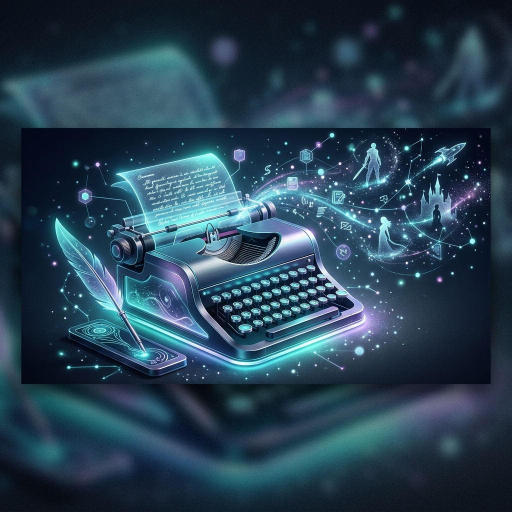

# AI Novelist 2.0



<div align="center">
  <h3>Revolutionizing Narrative Creation with Generative Intelligence</h3>
  <p>
    
    
    
    
    
  </p>
</div>

---

## 🌟 Overview

**AI Novelist 2.0** is a premium, high-performance writing platform designed for modern storytellers. By merging advanced generative AI (Google Gemini & AWS Bedrock) with a sophisticated suite of narrative tools, it empowers writers to build complex worlds, develop deep characters, and weave intricate plots with unprecedented ease.

Built with a focus on **visual excellence** and **intuitive workflows**, the platform features a stunning emerald-dark aesthetic, glassmorphism UI elements, and fluid animations.

---

## ✨ Key Features

| Feature | Description |
| :--- | :--- |
| **🚀 Landing Page** | A cinematic introduction to the world of AI-assisted writing. |
| **🏠 Story Dashboard** | Your central hub for managing multiple narrative projects and tracking progress. |
| **✍️ Advanced Editor** | A clean, focused writing environment with AI-powered expansion and "Generation Seeds". |
| **🎭 Character Hub** | Define character arcs, traits, and relationships with deep lore tracking. |
| **🌍 World Builder** | Map out your universe, from geography to the fundamental laws of magic or physics. |
| **⏳ Narrative Timeline** | Visualize the flow of events and manage chronological consistency across chapters. |
| **🎬 Scene System** | Breakdown your chapters into granular scenes for precise structural control. |
| **📊 Novel Overview** | A high-level architectural view of your story's themes, plot points, and pacing. |

---

## 🛠️ Tech Stack

### Frontend Architecture
- **React 19**: Utilizing the latest concurrent features for a responsive UI.
- **Vite**: Ultra-fast build tool and development server.
- **React Router 7**: Sophisticated client-side routing.
- **Framer Motion**: Smooth, high-end micro-interactions and transitions.
- **Lucide React**: Clean, consistent iconography.

### AI Orchestration
- **Google Generative AI**: Leveraging Gemini models for creative content generation.
- **AWS Bedrock**: Enterprise-grade AI foundation models for specialized tasks.

### Design System
- **Typography**: `Inter` for clarity, `Playfair Display` for elegance.
- **Color Palette**: A curated Emerald-on-Midnight theme (`#10b981` on `#030403`).
- **UI Components**: Custom-built vanilla CSS components with glassmorphism and backdrop filters.

---

## 🚀 Getting Started

### Prerequisites
- Node.js (v18 or higher)
- npm or yarn
- API keys for Google Gemini and/or AWS Bedrock

### Installation

1. **Clone the repository:**
   ```bash
   git clone https://github.com/your-username/ai-novelist-2.0.git
   cd ai-novelist-2.0
   ```

2. **Install dependencies:**
   ```bash
   npm install
   ```

3. **Configure environment variables:**
   Create a `.env` file in the root directory and add your credentials:
   ```env
   VITE_YOUR_API_KEY=your_key_here
   ```

4. **Launch the development server:**
   ```bash
   npm run dev
   ```

---

## 🎨 Design Philosophy

AI Novelist 2.0 isn't just a tool; it's an experience. We believe that a beautiful workspace inspires beautiful writing. Our design system focuses on:
- **Focus**: Minimal distractions in the writing core.
- **Elegance**: Premium typography and smooth gradients.
- **Feedback**: Interactive elements that feel alive and responsive.

---

<div align="center">
  <p>Crafted with ❤️ for writers everywhere.</p>
</div>
